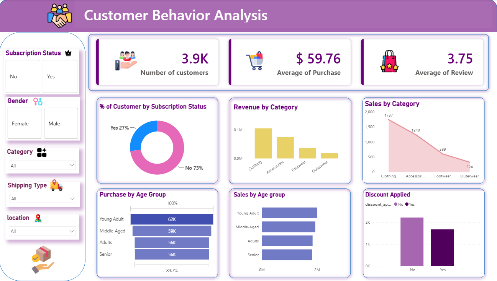

Customer Behavior Analysis Dashboard
📌 Overview

The Customer Behavior Analysis Dashboard is an end-to-end data analytics project that demonstrates the complete data analysis workflow—from raw data processing to interactive business intelligence reporting.

The project uses Python for data cleaning and exploratory data analysis (EDA), SQL Server for querying and analyzing customer data, and Power BI for creating an interactive dashboard that helps uncover customer purchasing patterns, revenue trends, and subscription behavior.

This project showcases practical skills in data preprocessing, SQL querying, business analysis, data visualization, and dashboard design, making it suitable for a Data Analyst portfolio.

## 📊 Dashboard Preview

🛠️ Tools & Technologies
Python,
Jupyter Notebook,
Pandas,
NumPy,
Matplotlib,
Seaborn,
SQL Server,
Power BI,
DAX,
Gamma (Presentation),
📈 Project Workflow
Step 1: Data Loading
Imported dataset into Jupyter Notebook
Loaded data using Pandas
Step 2: Data Cleaning

Performed data preprocessing by:

Handling missing values
Removing duplicate records
Correcting data types
Standardizing column names
Identifying outliers
Step 3: Exploratory Data Analysis (EDA)

Analyzed customer behavior using Python visualizations.

Performed:

Customer distribution analysis
Gender analysis
Age group analysis
Category analysis
Purchase amount analysis
Review rating analysis
Correlation analysis
Revenue trends

Libraries used:

Pandas
NumPy
Matplotlib
Seaborn
Step 4: SQL Analysis

Imported the cleaned dataset into SQL Server and performed business analysis using SQL queries.

Examples include:

Total customers
Average purchase amount
Revenue by category
Sales by gender
Customer segmentation
Subscription analysis
Top-selling products
Purchase frequency analysis

Used SQL concepts:

SELECT
WHERE
GROUP BY
ORDER BY
Aggregate Functions
CASE Statements
Common Table Expressions (CTEs)
Window Functions
Joins (where applicable)
Step 5: Power BI Dashboard

Built an interactive dashboard to visualize customer insights.

Dashboard Features:

KPI Cards
Interactive Slicers
Dynamic Report Title (DAX)
Revenue Analysis
Customer Analysis
Subscription Analysis
Discount Analysis
Sales Analysis
Age Group Analysis
📊 Dashboard Overview
KPIs
👥 Total Customers
💰 Average Purchase Amount
⭐ Average Review Rating
Interactive Filters
Subscription Status
Gender
Category
Shipping Type
Location
Visualizations
Customer Distribution by Subscription Status
Revenue by Category
Sales by Category
Purchase by Age Group
Sales by Age Group
Discount Applied Analysis
📷 Dashboard Preview

Customer Behavior Analysis Dashboard

(Insert your Power BI dashboard screenshot here)

🔍 Key Insights
Clothing category generated the highest revenue.
Majority of customers are non-subscribers.
Young Adults recorded the highest purchase amount.
Average purchase value is approximately $59.76.
Average customer review rating is 3.75.
Discounts influenced customer purchasing behavior.
📑 Deliverables
✅ Cleaned Dataset
✅ Python EDA Notebook
✅ SQL Scripts
✅ Power BI Dashboard
✅ Project Report
✅ Gamma Presentation (PPT)
📁 Project Structure
Customer-Behavior-Analysis/
│
├── Dataset/
│   ├── customer_data.csv
│
├── Python/
│   ├── Customer_Behavior_EDA.ipynb
│
├── SQL/
│   ├── customer_analysis.sql
│
├── PowerBI/
│   ├── Customer_Behavior_Analysis.pbix
│
├── Dashboard/
│   ├── dashboard.png
│
├── Report/
│   ├── Project_Report.pdf
│
├── Presentation/
│   ├── Gamma_Presentation.pdf
│
├── README.md
▶️ How to Run
Python
Clone this repository.
Open the Jupyter Notebook.
Install the required libraries:
pip install pandas numpy matplotlib seaborn
Run all notebook cells to perform data cleaning and EDA.
SQL Server
Import the cleaned dataset into SQL Server.
Execute the SQL scripts provided in the SQL/ folder.
Analyze the generated results.
Power BI
Open the .pbix file.
Refresh the dataset if necessary.
Explore the interactive dashboard using the slicers.
📌 Skills Demonstrated
Data Cleaning,
Exploratory Data Analysis (EDA),
SQL Query Writing,
Data Visualization,
Dashboard Design,
Business Intelligence,
DAX,
Data Storytelling,
Report Creation,
Presentation Development,

